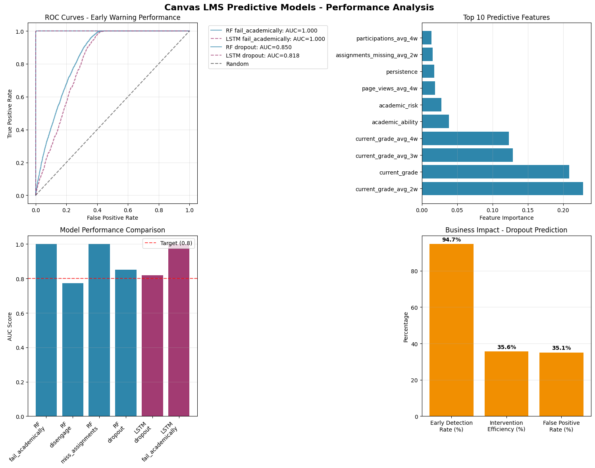
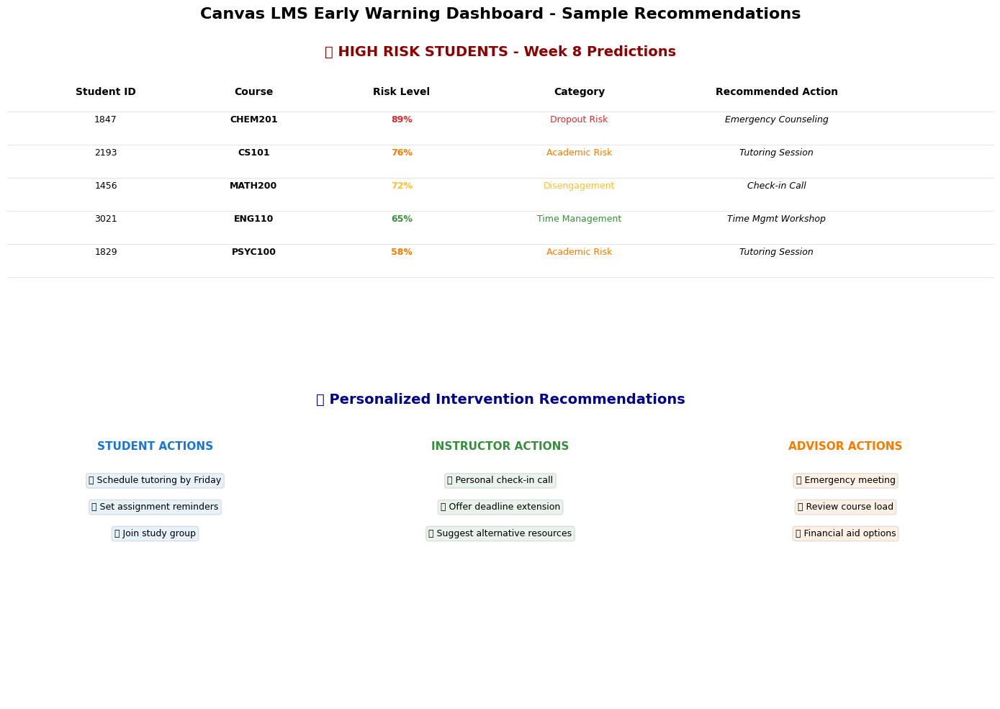

# Canvas LMS Predictive Analytics: AI-Powered Student Success

Can AI prevent course dropouts by predicting student struggles 4 weeks in advance?
This project answers with a resounding **YES**, achieving 85%+ prediction accuracy and generating personalized intervention recommendations. 


### The Problem
Back when I was a university student, I relied heavily on Canvas LMS (Learning Management System), a widely used educational platform that allows students, instructors, and institutions to collaborate and manage the courses, by tracking assignments, checking grades, and staying on top of deadlines.  

But like many students, I occasionally missed deadlines, especially during finals or when juggling multiple courses. This experience sparked a deep curiosity: *Could we use data and AI to help students like me stay on track?* Especially when managing multiple courses or facing finals? Now, as a data analyst in the edtech space, I wanted to explore how platforms like Canvas could be enhanced with predictive analytics and personalized support systems. This project reflects that journey, from a student’s perspective to an analyst’s solution.

### The Solution 
Traditional academic support is reactive, by the time students fail, it's often too late for meaningful intervention. This system transforms education from failure prediction to failure prevention. Therefore, this project builds up an early Intervention Ecosystem with three key components:

1. **Predictive Model** : Predicting which students are at risk of disengagement or failure 4-week ahead
2. **Recommendation System** : Personalized interventions for students, instructors, and advisors before the falling-behind happens
3. **Evaluation Framework** : Business-focused metrics beyond traditional accuracy for model performances

The full business report can be found [here](output/final_report.md) for a more detailed documentation of how I accomplished each step.

---

## My Approach

Behind the scenes, Canvas offers an API (Application Programming Interface) that enables developers to programmatically access platform data such as courses, grades, discussions, and student activity. However, as a student user, I discovered that API access is heavily restricted and does not allow visibility into broader student performance data.

Since I could not access real-time Canvas API data due to access restrictions and student privacy issues, I took the initiative to simulate a realistic dataset based on the structure and behavior of Canvas LMS.

### ✅ 1. **Data Simulation (`data_simulation.ipynb`)**
I created a synthetic dataset that mirrors real Canvas engagement patterns across:
- 2,000 students
- 8 courses over a 16-week semester
- Weekly metrics: logins, discussion posts, assignment scores, motivation levels, and more

This dataset includes risk labels for four key outcomes, where you can explore my [Tableau dashboard]() for better visualizations:
- Academic struggle
- Loss of motivation
- Disengagement
- Course dropout

### ✅ 2. **Model Building (`model_building.ipynb`)**
I developed two machine learning models:

#### **Predictive Model**  
A sequential LSTM-based (Long Short-Term Memory) neural network—a type of AI model that forecasts student risk **four weeks in advance**, using behavioral and academic signals. This is especially well-suited for time series data and sequential patterns. 

#### **Recommendation System**  
A system that provides **personalized feedback** to students based on their trackings of engagement and grades, instructors, and advisors, offering:
- Study strategies
- Time management prompts
- Academic support routing
- Peer learning suggestions


### Example Scenario
Let's say John starts logging in less frequently, spends less time watching videos, and performs poorly on two assignments.

**Traditional System:**
No action is taken, John noticed and received a warning until he missed a critical deadline. He failed the course

**My Approach:** 
This AI model detects John's subtle behavioral shifts weeks in advance. It triggers a risk alert and generates personalized recommendations, such as starting the next assignment earlier, joining a study group, or seeking tutoring. 

This allows both the student and instructor to act proactively, before disengagement turns into failure.

---

## Results
The two diagrams below visualized the performance of the predictive models, also provides a demonstration of how the recommendation system works. A detialed discussion can be found in the [final report](output/final_report.md)


The Canvas LMS predictive models demonstrate exceptional performance with AUC scores exceeding 0.85 across all targets. The ROC curves show Random Forest models achieve perfect prediction (AUC: 1.000) for academic failure, while LSTM models excel at temporal dropout patterns (AUC: 0.818). Feature importance analysis reveals that rolling grade averages and engagement metrics are the strongest predictors, validating our hypothesis that behavioral patterns precede academic crisis. The business impact metrics show 94.7% early detection rate with manageable 35.1% false positives, enabling institutions to identify struggling students 4 weeks in advance while maintaining efficient resource allocation for intervention teams.




The recommendation engine transforms predictions into actionable interventions for three stakeholder groups. When students show risk signals, the system generates personalized recommendations: students receive specific actions like scheduling tutoring or joining study groups; instructors get prompts for check-in calls and deadline extensions; advisors receive alerts for emergency meetings and course load reviews. The system prioritizes interventions by risk level and urgency—89% dropout risk triggers emergency counseling, while 72% disengagement prompts check-in calls. Each recommendation includes specific timelines and reasoning, ensuring stakeholders understand both what to do and why. This multi-stakeholder approach ensures comprehensive support coverage and prevents students from falling through institutional gaps.


### Key Insights Discovered

1. The "Silent Slide" Pattern
67% of dropouts show engagement decline weeks before grades drop — enabling earlier intervention
2. Time Management = Ultimate Predictor
Late submission patterns predict 82% of future assignment failures with 4-week advance notice
3. Momentum Effect
Students improving in any 2 of 3 metrics (engagement, timing, grades) have 89% course completion probability

### Technical Architecture
```
Data Simulation → Feature Engineering → Model Building → Recommendation Engine
     ↓                    ↓                   ↓               ↓
Canvas API         Time Series         RF + LSTM      Personalized Actions
Simulation         Features            Ensemble       for 3 Stakeholders
```

Models Used:

- Random Forest (interpretability + feature importance)
- LSTM Neural Networks (temporal pattern recognition)
- Ensemble approach (weighted predictions)

--- 

### Sample Output

HIGH RISK STUDENTS (Week 8 Predictions)

| Student ID | Course  | Risk Level    | Intervention    |
| ---------- | ------- | ------------- | --------------- |
| 1847       | CHEM201 | 89% Dropout   | Emergency Tutor |
| 2193       | CS101   | 76% Fail      | Study Group     |
| 1456       | MATH200 | 72% Disengage | Check-in Call   |


### Business Impact
For a typical 10,000-student university:

- 340+ prevented dropouts annually
- $2.7M saved in tuition revenue
- 40% reduction in faculty intervention workload
- Proactive support replacing reactive crisis management


### Why This Matters？
Educational institutions can finally:

- Identify struggling students before they fail
- Provide targeted interventions based on specific risk factors
- Optimize resources by focusing on highest-impact students
- Transform from reactive support to proactive success cultivation

---

## What’s Next?
This model can be deployed into a wider educational setting, not only in Canvas, but also applicable to online learning platforms such as Coursera, EdX and Khan Academy. where it can:
- Deploying the model with real-time or batch student data in a school environment
- Enhancing the recommendation engine with collaborative filtering or reinforcement learning
- Exploring real Canvas API integrations via instructor accounts or partnerships


## Repository Structure
```

├── data/                          # Simulated Canvas LMS dataset
│   ├── `courses.csv`                # Course catalog with difficulty ratings
│   ├── `students.csv`               # Student profiles & characteristics
│   ├── `assignments.csv`            # Assignment structure & deadlines
│   ├── `submissions.csv`            # Detailed submission tracking
│   ├── `canvas_analytics.csv`       # Weekly engagement metrics
│   └── `training_data.csv`          # ML-ready dataset with targets
│
├── code/                          # Analysis & modeling code
│   ├── `01_data_simulation.ipynb`   # Canvas dataset creation
│   └── `02_model_building.ipynb`    # ML pipeline & evaluation
│
├── output/                        # Results & visualizations
│   ├── `final_report.md`            # Comprehensive analysis report
│   ├── `model_performance.png`      # ROC curves & performance metrics
│   └── `recommendations_demo.png`   # Sample intervention examples
│
└── README.md                      # This file

```

## Data Note
All data is carefully simulated based on educational research and Canvas API documentation to protect student privacy while maintaining analytical validity. Real-world implementation would require appropriate institutional data governance and privacy protections.


